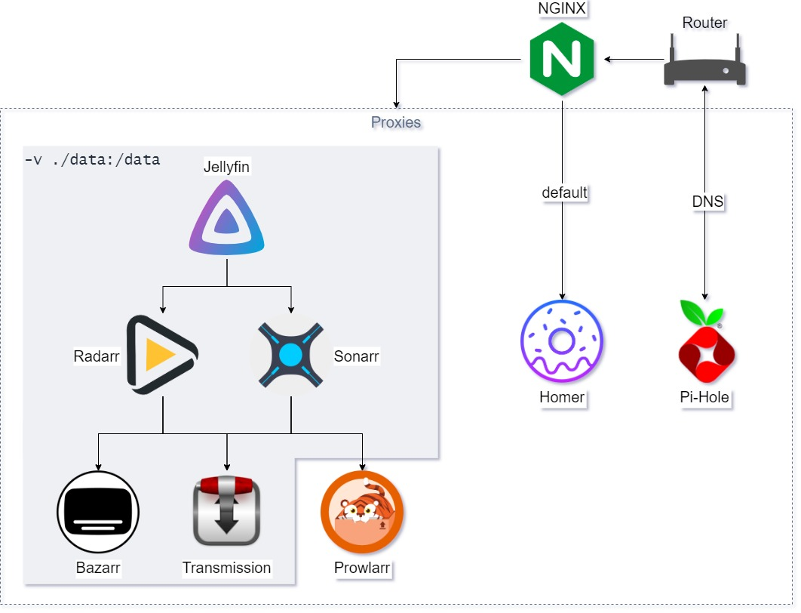

# servarr

## *arr components

- [radarr](https://github.com/Radarr/Radarr)
- [sonarr](https://github.com/Sonarr/Sonarr)
- [prowlarr](https://github.com/Prowlarr/Prowlarr)
- [bazarr](https://github.com/morpheus65535/bazarr)

## additional
- [homer](https://github.com/bastienwirtz/homer)
- [nginx](https://github.com/nginx/nginx)
- [transmission](https://github.com/transmission/transmission)
- [jellyfin](https://github.com/jellyfin/jellyfin)
- [pihole](https://github.com/pi-hole/pi-hole)

